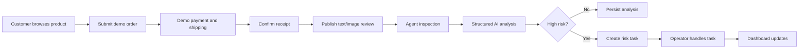
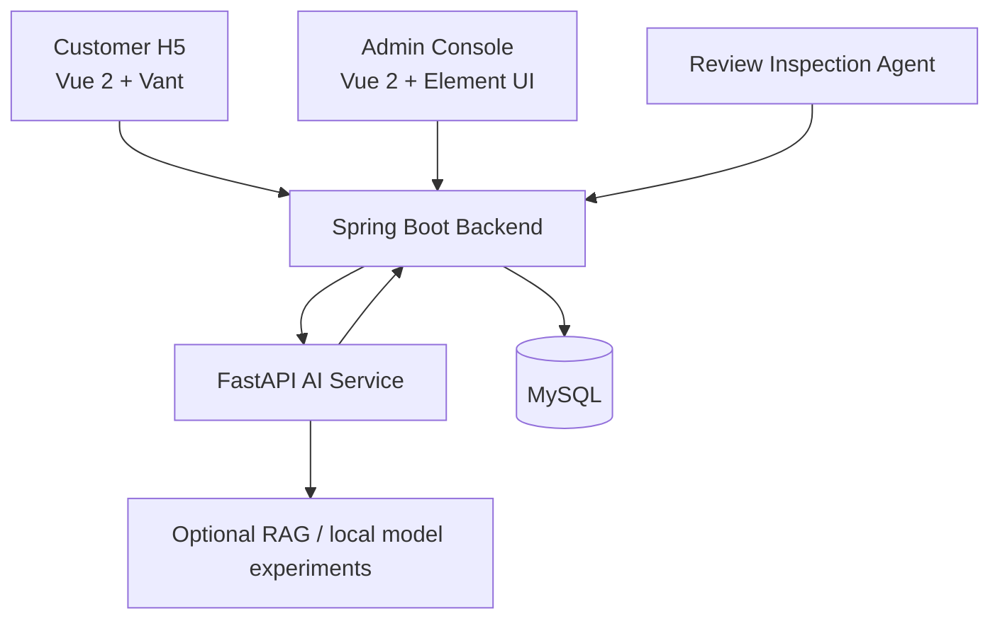

# E-Review Agent

Enterprise-oriented e-commerce review governance system with AI analysis, Agent inspection, risk workflows and auditable readiness boundaries.


## Overview

E-Review Agent extends the open-source [linlinjava/litemall](https://github.com/linlinjava/litemall) project into a review-governance prototype for graduation-project, engineering-practice and portfolio demonstration.

The core loop is:

1. A customer browses products in the H5 storefront.
2. The customer submits an order through a demo payment and demo shipping flow.
3. The customer confirms receipt and publishes a text/image review.
4. The backend stores the review in the original litemall comment table.
5. The inspection Agent scans unprocessed comments.
6. The AI service returns structured review analysis.
7. High-risk results generate risk tasks.
8. Operators handle tasks in the admin console.
9. Dashboard metrics update from persisted records.

Payment, logistics and refund integrations are demo-mode implementations. This repository does not claim production readiness.

## Highlights

| Area | What it demonstrates |
|---|---|
| Customer-to-Agent loop | End-to-end review governance from H5 customer review to admin operation workflow |
| Agent inspection | Manual or scheduled scanning of unprocessed comments |
| Structured AI analysis | JSON-contract based sentiment, risk level, risk type and operation suggestion output |
| Risk workflow | Risk task creation, detail view, status transition and operation log |
| Public audit boundary | Sanitized source snapshot without model weights, private data, raw benchmark assets or internal Git history |

## Business Flow



## Architecture



## Tech Stack

| Layer | Stack |
|---|---|
| Backend | Java, Spring Boot, Maven, MyBatis |
| Admin frontend | Vue 2, Element UI, Axios |
| Customer H5 | Vue 2, Vant 2, Vuex, Vue Router |
| AI service | Python, FastAPI, Pydantic, pytest |
| Data | MySQL |
| Optional experiments | Local model adapters, VLM provider wiring, BGE-M3/FAISS retrieval code paths |

## Repository Structure

```text
e-review-agent/
|-- ai-service/          # FastAPI AI service and public tests
|-- data/                # Public schemas and governance metadata
|-- litemall-admin/      # Vue 2 admin console
|-- litemall-vue/        # Vue 2 + Vant customer H5 frontend
|-- litemall-admin-api/  # Spring Boot admin API
|-- litemall-wx-api/     # Spring Boot customer API
|-- litemall-db/         # Database schema, mappers and AI SQL migrations
|-- litemall-core/       # Shared Java configuration and infrastructure
|-- litemall-all/        # Combined Spring Boot entry
|-- docs/                # Public project documentation
`-- compose.public.yml   # Public Docker Compose runtime used by CI
```

## Quick Start

### Requirements

- JDK 8+
- Maven 3.6+
- MySQL 5.7 or 8.x
- Node.js compatible with Vue CLI 3/4 projects
- Python 3.10+

### Database

```bash
mysql -u root -p
CREATE DATABASE litemall DEFAULT CHARACTER SET utf8mb4 COLLATE utf8mb4_unicode_ci;
```

Import schema and AI migration SQL files from `litemall-db/sql/` as needed. This public snapshot does not include production database backups.

### Java Backend

```bash
mvn test
mvn -DskipTests package
```

Typical local service ports:

- wx-api: `http://localhost:8080`
- admin-api: `http://localhost:8083`

### AI Service

```bash
cd ai-service
python -m venv .venv
.venv/Scripts/activate
pip install -r requirements.txt
python -m pytest -ra
uvicorn app.main:app --host 0.0.0.0 --port 8008
```

### Admin Console

```bash
cd litemall-admin
npm ci
npm run build:prod
npm run dev
```

### Customer H5

```bash
cd litemall-vue
npm ci
npm run build:prod
npm run dev
```

## Public Test Scope

The public snapshot includes a reproducible subset of the internal test suite. Private-data, model-asset and internal benchmark dependent tests are excluded from this repository.

| Evidence | Current public status |
|---|---|
| Public Python test suite | PASS in GitHub Actions `public-ci` run `29650925931` |
| Java unit tests | PASS in GitHub Actions `public-ci` run `29650925931` |
| Java packaging | PASS in GitHub Actions `public-ci` run `29650925931` |
| Admin production build | PASS in GitHub Actions `public-ci` run `29650925931` |
| Customer production build | PASS in GitHub Actions `public-ci` run `29650925931` |
| Local gitleaks scan | PASS locally with gitleaks `8.24.3` during publication hardening |
| GitHub gitleaks workflow | PASS in GitHub Actions `secret-scan` run `29650925951` |
| Public Docker runtime | PASS in GitHub Actions `public-runtime-ci` run `29656286535` |
| Customer-to-Agent E2E smoke | PASS in GitHub Actions `public-runtime-ci` run `29656286535` |
| AI unavailable/recovery smoke | PASS in GitHub Actions `public-runtime-ci` run `29656286535` |
| Production readiness | Not claimed |

## AI Capability Boundaries

- Rule/mock mode is sufficient for the core business demo and does not require model weights.
- Local text-model, VLM and RAG paths are experimental and optional.
- Model weights, adapters, checkpoints, FAISS indexes and private datasets are intentionally excluded.
- AI output is decision support. Important operational decisions should still keep human review.

## Docker Compose

Public Docker runtime verification is implemented in `compose.public.yml` and `.github/workflows/public-runtime-ci.yml`.

```bash
docker compose -f compose.public.yml config
docker compose -f compose.public.yml build
docker compose -p ereview-public-local -f compose.public.yml up -d
PUBLIC_COMPOSE_PROJECT=ereview-public-local python scripts/ci/wait_for_public_runtime.py
python scripts/ci/public_business_smoke.py
PUBLIC_COMPOSE_PROJECT=ereview-public-local python scripts/ci/public_ai_unavailable_smoke.py
docker compose -p ereview-public-local -f compose.public.yml down -v --remove-orphans
```

Public Docker verification uses a deterministic public rule engine so the business workflow can be reproduced without private model assets. This mode does not represent the private local-model or Enterprise RAG runtime.

Latest remote runtime verification:

- Public Runtime CI: PASS, run `29656286535`, job `public-runtime-phase2`.
- Public CI: PASS, run `29656286537`, jobs `repository-hygiene`, `java-test`, `python-test`, `admin-build`, `customer-build`.
- Secret Scan: PASS, run `29656286534`, job `gitleaks`.
- Draft PR: [#27](https://github.com/dafenqirunrunrun/e-review-agent/pull/27).

Runtime docs:

- [Public Runtime Audit](docs/runtime/PUBLIC_RUNTIME_AUDIT.md)
- [Public Docker Runbook](docs/runtime/PUBLIC_DOCKER_RUNBOOK.md)
- [Public Business E2E](docs/runtime/PUBLIC_BUSINESS_E2E.md)
- [Public Runtime Limitations](docs/runtime/PUBLIC_RUNTIME_LIMITATIONS.md)

## Open Source Scope

This is a sanitized public snapshot. It excludes:

- internal Git history;
- model weights, adapters and checkpoints;
- private datasets and raw training data;
- full benchmark corpora;
- real user data and database backups;
- FAISS or other large index binaries;
- detailed soak raw logs;
- screenshots containing personal information, secrets or local paths.

See [docs/OPEN_SOURCE_SCOPE.md](docs/OPEN_SOURCE_SCOPE.md) and [THIRD_PARTY_NOTICES.md](THIRD_PARTY_NOTICES.md).

## Security

Do not publish passwords, tokens, cookies, database dumps, private keys, real user data or screenshots containing sensitive information. See [SECURITY.md](SECURITY.md).

## License

This snapshot retains the upstream litemall MIT license boundary and adds E-Review Agent project files under the repository license. See [THIRD_PARTY_NOTICES.md](THIRD_PARTY_NOTICES.md).
