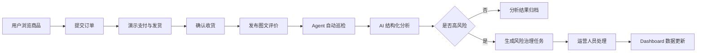
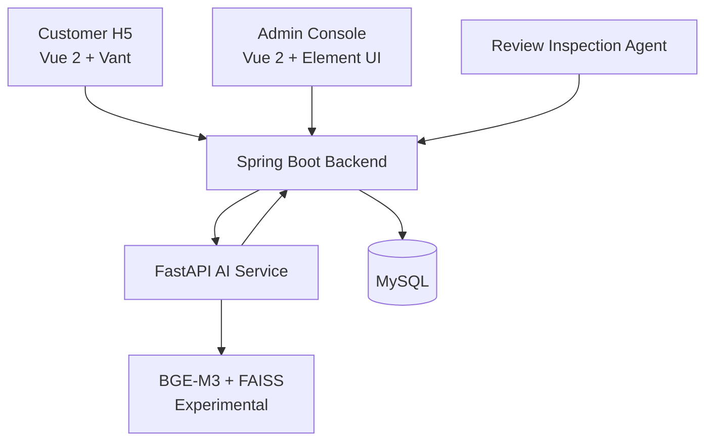

# E-Review Agent

> Enterprise-Oriented E-commerce Review Governance System

基于真实电商业务闭环的 AI 评论分析、Agent 自动巡检、风险治理与运营处置系统。本项目基于开源项目 [linlinjava/litemall](https://github.com/linlinjava/litemall) 二次开发，面向毕业设计、工程实践和求职作品集展示。


## Project Overview

E-Review Agent 将 litemall 的用户端商城、管理后台、Java 后端、FastAPI AI 服务和 MySQL 数据库组合成一个完整的评论治理闭环：

- 用户可以浏览商品、提交订单、使用演示支付/演示发货、确认收货并发布图文评价。
- 后台 Agent 定时或手动巡检真实商品评价。
- AI 服务输出结构化评论分析，包括情感、风险等级、风险类型和处理建议。
- 高风险评价自动生成风险治理任务。
- 运营人员在后台完成采纳、处理、关闭和日志留痕。
- Dashboard 汇总展示待分析评论、风险任务、处理状态和巡检结果。

支付、物流和退款均为毕业设计演示实现，不接入真实第三方渠道。

## Highlights

| Highlight | What it demonstrates |
|---|---|
| 真实电商评论闭环 | 从 H5 用户端评价到后台治理任务的端到端链路 |
| Agent 自动巡检 | 定时/手动扫描未分析评论，避免后台人工逐条触发 |
| 结构化 AI 分析 | 统一 JSON contract，便于落库、统计和运营处理 |
| 风险治理工作流 | 风险任务生成、详情查看、处理状态流转和操作日志 |
| RAG 与本地模型实验 | BGE-M3、FAISS、本地模型和 VLM 作为高级实验模块 |
| 可审计 readiness 证据 | 测试、隔离、安全卫生、soak 和 gate 证据有明确边界 |

## Business Flow



## Architecture



## Modules

- 用户端商城：商品浏览、商品详情、订单演示链路、图文评价。
- 管理后台：评论列表、AI 工作台、Dashboard、风险中心、运营中心。
- Java 后端：wx-api、admin-api、数据库服务、Agent 巡检和风险任务接口。
- FastAPI AI 服务：规则/Mock 模式、结构化输出、schema 校验、RAG/本地模型实验接口。
- MySQL 数据库：litemall 原始表、AI 分析表、风险任务表、巡检日志表、运营日志表。
- Readiness 审计：测试报告、隔离检查、安全卫生检查、soak 和 gate 证据摘要。

## Tech Stack

| Area | Stack |
|---|---|
| Backend | Java, Spring Boot, Maven, MyBatis |
| Admin | Vue 2, Element UI, Axios |
| Customer H5 | Vue 2, Vant 2, Vuex, Vue Router |
| AI Service | Python, FastAPI, Pydantic, pytest |
| Data and Retrieval | MySQL, BGE-M3, FAISS experimental retrieval |
| Engineering | Docker Compose config, smoke checks, Java/Python tests |

## Repository Structure

```text
e-review-agent/
├── ai-service/          # FastAPI AI service and tests
├── data/                # Public schemas and governance metadata only
├── litemall-admin/      # Vue 2 admin console
├── litemall-vue/        # Vue 2 + Vant customer H5 frontend
├── litemall-admin-api/  # Spring Boot admin API
├── litemall-wx-api/     # Spring Boot customer API
├── litemall-db/         # Database schema, mappers and AI SQL migrations
├── litemall-core/       # Shared Java configuration and infrastructure
├── litemall-all/        # Combined Spring Boot entry
├── docs/                # Curated public project documentation
├── docker-compose.yml   # Compose configuration, runtime evidence pending
└── README.md
```

## Quick Start

### Requirements

- JDK 8+
- Maven 3.6+
- MySQL 5.7/8.x
- Node.js compatible with Vue CLI 3 projects
- Python 3.10+

### Database

```bash
mysql -u root -p
CREATE DATABASE litemall DEFAULT CHARACTER SET utf8mb4 COLLATE utf8mb4_unicode_ci;
```

Import schema and AI migration SQL files from `litemall-db/sql/` as needed. This public snapshot does not include production database backups.

### Java Backend

```bash
mvn -DskipTests package
```

Typical local services:

- wx-api: `http://localhost:8080`
- admin-api: `http://localhost:8083`

### AI Service

```bash
cd ai-service
python -m venv .venv
.venv/Scripts/activate
pip install -r requirements.txt
python -m pytest
uvicorn app.main:app --host 0.0.0.0 --port 8008
```

### Admin Console

```bash
cd litemall-admin
npm install
npm run build:prod
npm run dev
```

### Customer H5

```bash
cd litemall-vue
npm install
npm run build:prod
npm run dev
```

## Docker Compose（配置已提供，运行证据待补）

本仓库提供 Docker Compose 配置，便于后续 clean-room build 和部署验证。当前公开说明不声称 Docker runtime 已经完整通过；只有在远程 CI 或本地 Docker daemon 实际构建、启动和健康检查成功后，才应更新为 Docker Compose Quick Start。

## Tests and Evidence

历史本地验证证据属于指定 commit 和本地验证环境：

| Evidence | Result |
|---|---|
| Python tests | 407 passed |
| Java tests | 20 passed |
| 90-minute active soak | passed |
| External isolation audit | passed |
| Security hygiene audit | passed |
| Local runtime gate | passed |
| Full enterprise gate | not passed |
| Docker runtime | pending verification |

这些结果用于说明工程验证过程，不代表生产安全认证或商业部署结论。

公开快照排除了依赖私有本地脚本、真实世界数据接入、原始 benchmark 资产、模型文件和完整 soak 明细日志的测试；这些资产按开源边界保留在 Git 之外。
`ai-service/pytest.ini` 将默认测试集限定为可公开复现的核心 API、schema、Agent、tenant isolation 和 provider wiring 测试。

## AI Capability Boundaries

- Rule / Mock Mode：核心业务演示默认可使用规则能力，不依赖大模型权重。
- Local Text Model Experiment：用于结构化输出和本地模型实验，模型权重不在仓库内。
- Local VLM Experiment：用于图文评论研究，真实图片和模型文件不公开。
- Synthetic SFT Experiment：只保留工程代码和公开说明，不公开私有训练集、adapter 或 checkpoint。
- Enterprise RAG Experiment：BGE-M3 + FAISS 属于高级实验模块，不是交易主链路依赖。

AI 输出用于辅助风险识别，重要运营处置仍保留人工确认。

## Readiness Status

| Capability | Status |
|---|---|
| Customer review loop | Complete |
| Agent inspection | Complete |
| Risk workflow | Complete |
| Python tests | Passed |
| Java tests | Passed |
| Active soak | Passed |
| Local runtime gate | Passed |
| Docker static config | Passed |
| Docker runtime | Pending verification |
| Enterprise pilot ready | Not claimed |
| Production ready | Not claimed |

## Screenshots

Safe demo screenshots can be added under `docs/images/` later. Recommended filenames:

- `customer-product-page.png`
- `customer-review-submit.png`
- `admin-ai-dashboard.png`
- `agent-inspection-center.png`
- `risk-task-center.png`
- `operation-workflow.png`

Do not upload screenshots containing personal information, local paths, emails, tokens, phone numbers or real user data.

## Roadmap

- CI clean-room build
- Docker runtime verification
- Automated business E2E test
- OpenTelemetry observability
- Backup and restore drill
- SBOM and dependency scanning
- AI online quality monitoring

## Open Source Notice

This repository is for learning, graduation project demonstration, engineering practice and technical communication. It is based on litemall and retains the upstream MIT license notice. Payment, logistics and refund features are demo implementations. Do not use it directly in a real production environment without independent security, privacy and operational review.

## License

Licensed under the MIT License. See [LICENSE](LICENSE), [NOTICE.md](NOTICE.md) and [THIRD_PARTY_NOTICES.md](THIRD_PARTY_NOTICES.md).
