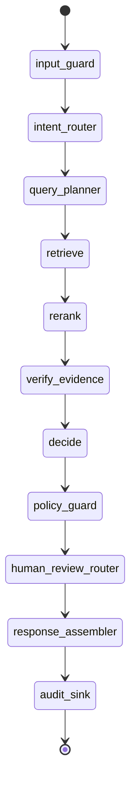

# Governed Agent Design

The Agent is bounded by configured maximum steps and tool calls. It cannot execute shell, Python, network fetches, or business write actions. Registered tools are read-only or human-review routing tools.
