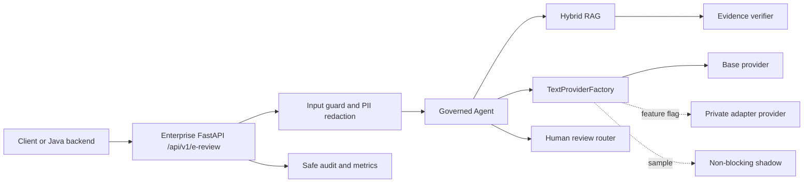

# Enterprise Architecture

Default runtime mode is `base`. Adapter mode is feature-flagged and rolls back to Base on validation or runtime failures. Shadow execution is non-blocking and stores only aggregate agreement metrics.
