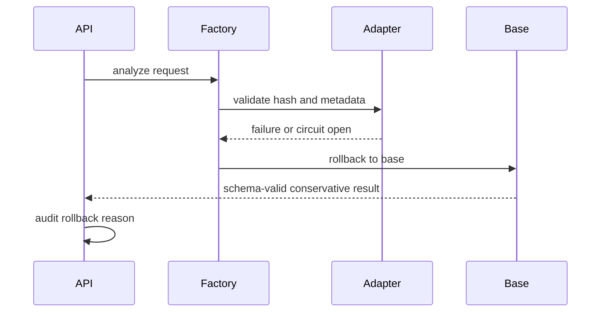

# Failure Recovery

Rollback triggers include adapter hash mismatch, load failure, CUDA OOM, repeated schema failure, repeated fallback, latency circuit breaker, prohibited action, GPU lock loss, and external compute contention. After rollback, adapter is not automatically restored.
