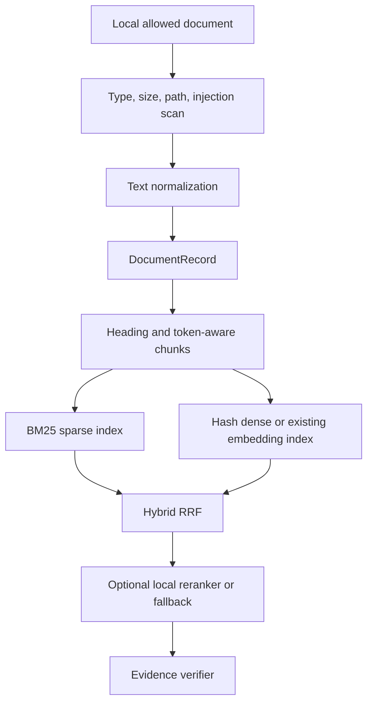

# Governed RAG Design

```mermaid
flowchart TD
  Source["Local allowed document"] --> Validate["Type, size, path, injection scan"]
  Validate --> Normalize["Text normalization"]
  Normalize --> Contract["DocumentRecord"]
  Contract --> Chunk["Heading and token-aware chunks"]
  Chunk --> Sparse["BM25 sparse index"]
  Chunk --> Dense["Hash dense or existing embedding index"]
  Sparse --> RRF["Hybrid RRF"]
  Dense --> RRF
  RRF --> Rerank["Optional local reranker or fallback"]
  Rerank --> Evidence["Evidence verifier"]
```

Documents and chunks carry tenant, version, trust, active/tombstone, content hash, and source hash fields. Retrieved text is always treated as `UNTRUSTED_RETRIEVED_CONTENT`.
